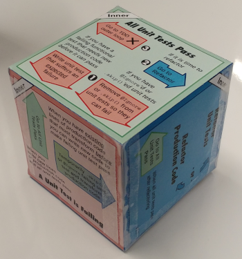
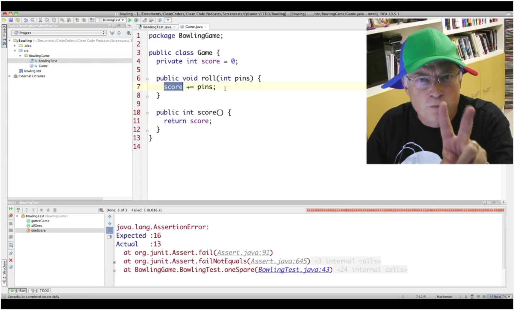

# TDD Training Cube

The TDD Training Cube helps you keep track of which Outside-In Test-Driven Development phase you 
are currently operating in and what steps to take once you get there.  Print out the [.pdf file](https://github.com/Nike-Inc/tdd-training-cube/blob/master/TDDCube.pdf) [⬇](https://github.com/Nike-Inc/tdd-training-cube/raw/master/TDDCube.pdf "Download"), 
follow the assembly instructions, and use the TDD Training Cube whenever you practice test-driving 
your code.  Each face of the TDD Training Cube contains [conditions and actions](https://github.com/Nike-Inc/tdd-training-cube/blob/master/TDDCubeCheatSheet.pdf) [⬇](https://github.com/Nike-Inc/tdd-training-cube/raw/master/TDDCubeCheatSheet.pdf "Download") to take in order to 
transition between TDD phases; use the up-face of the cube as a reminder of what you are doing in 
each TDD cycle.

The six
Outside-In Test-Driven Development phases depicted on the TDD Training Cube are:

* (Green, Outer, Start Here) **All Functional Tests Pass**
* (Red, Outer) **A Functional Test is Failing**
* (Blue, Outer) **Refactor Functional Tests** -or- **Perform DevOps Tasks**
* (Green, Inner) **All Unit Tests Pass**
* (Red, Inner) **A Unit Test is Failing**
* (Blue, Inner) **Refactor Unit Tests** -or- **Refactor Production Code**

&nbsp;

## History

The TDD Training Cube was inspired by Uncle Bob's tri-billed, red-green-refactor baseball cap.
Uncle Bob turns his cap to indicate to the viewer which TDD phase he is currently operating in 
while he demonstrates test-driven development.

We had our own Test-Driven Development screencast videos to produce for the TDD Learnstitute.  But, 
we needed to track which of the six Outside-In TDD phases we were in, rather than Uncle Bob's three
phases.  We felt it would be too silly to construct a six-billed red-green-refactor hat for our 
videos.  So, we opted instead to create a papercraft cube where, similar to Uncle Bob's cap, the 
face of the cube displayed to the viewer indicates which TDD phase we are currently operating in.

Also, Harry J. W. Percival's [Obey the Testing Goat](http://www.obeythetestinggoat.com/) includes a [workflow diagram](http://www.obeythetestinggoat.com/book/chapter_working_incrementally.html#TDD-double-loop) that influenced the development of the TDD Training Cube. 
&nbsp;

## Protips

Handy tips to get the most out of your TDD Training Cube:

* Reminder: you control your cube, your cube does _not_ control you
* TDD Training Cube power levels will naturally increase with code coverage.  **Never** exceed 
  the posted, safe, 100% code coverage limits
* Do not taunt TDD Training Cube!
* Do not hold your TDD Training Cube close to an LSS Training Sphere or an OE-1 Training Hyperboloid
  due to continuity slippage risks
* Never open the TDD Training Cube.  Though it is a wondrous item, once opened, TDD Training Cube 
  will cease to contain an extradimensional space

&nbsp;

---

The TDD Training Cube is Copyright (C) 2019, Nike, Inc.  It is licensed under the Creative Commons 
Attribution 4.0 International license.

